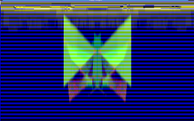
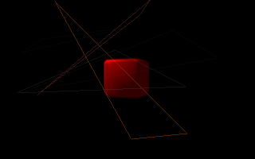

# pixelpusher


[](http://godoc.org/github.com/xyproto/pixelpusher)
[](https://raw.githubusercontent.com/xyproto/pixelpusher/master/LICENSE)
[](https://goreportcard.com/report/github.com/xyproto/pixelpusher)

Concurrent software rendering, triangle rasterization and pixel buffer manipulation.

 

 

 

## Features and limitations

* Can draw software-rendered triangles concurrently, using goroutines. The work of drawing the triangles is divided on the available CPU cores.
* Provides flat-shaded triangles.
* Everything is drawn to a `[]uint32` pixel buffer (containing "red", "green", "blue" and "alpha").
* Tested together with SDL2, but can be used with any graphics library that can output pixels from a pixel buffer.
* The software rendering of 3D graphics in the screenshot above is provided by [fauxgl](https://github.com/fogleman/fauxgl). The outputs from this can be combined with effects from `pixelpusher`.

## Getting started

This program imports `pixelpusher`, sets up a callback function for drawing pixels to the `gfx.Pixels` slice, creates a `pixelpusher.Config` struct and then calls the `.Run` function. The window title is `Red Pixel`:

```go
package main

import (
    pp "github.com/xyproto/pixelpusher"
)

func onDraw(canvas *pp.Canvas) error {
    // x=0, y=0, red=255, green=0, blue=0
    return pp.Plot(canvas, 0, 0, 255, 0, 0)
}

func main() {
    // The window title is "Red Pixel"
    canvas := pp.New("Red Pixel")
    // onDraw will be called whenever it is time to draw a frame
    canvas.Run(onDraw, nil, nil, nil)
}
```

This program allows the user to press the arrow keys or the WASD keys to move a red pixel around and draw something. Press `ctrl-s` to save the image and press `Esc` or `q` to quit.

```go
package main

import (
    "errors"

    pp "github.com/xyproto/pixelpusher"
)

var x, y = 160, 100

func onDraw(canvas *pp.Canvas) error {
    return pp.Plot(canvas, x, y, 255, 0, 0)
}

func onPress(left, right, up, down, space, enter, esc bool) error {
    if up {
        y--
    } else if down {
        y++
    }
    if left {
        x--
    } else if right {
        x++
    }
    if esc {
        return errors.New("quit")
    }
    return nil
}

func main() {
    pp.New("Simple Draw").Run(onDraw, onPress, nil, nil)
}
```

# General information

* Version: 1.2.0
* License: BSD-3
* Author: Alexander F. Rødseth &lt;xyproto@archlinux.org&gt;
