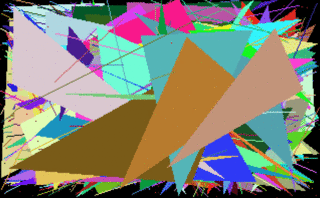
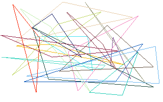
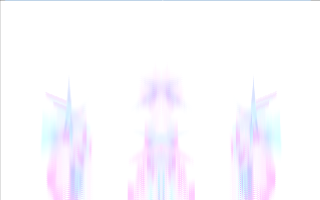
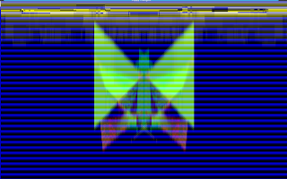
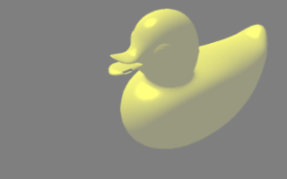
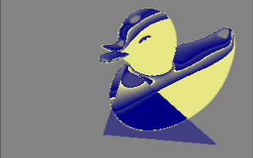

# pixelpusher

[](https://travis-ci.com/xyproto/pixelpusher)
[](http://godoc.org/github.com/xyproto/pixelpusher)
[](https://raw.githubusercontent.com/xyproto/pixelpusher/master/LICENSE)
[](https://goreportcard.com/report/github.com/xyproto/pixelpusher)

Fast concurrent software rendering, triangle rasterization and pixel buffer manipulation.

 

 

 


## Features and limitations

* Can draw software-rendered triangles concurrently, using goroutines. The work of drawing the triangles is divided on the available CPU cores.
* Provides flat-shaded triangles.
* Everything is drawn to a `[]uint32` pixel buffer (containing "red", "green", "blue" and "alpha").
* Tested together with SDL2, but can be used with any graphics library that can output pixels from a pixel buffer.
* Everything you need for creating an oldschool game or demoscene demo that will run on Linux, macOS and Windows, while using all of the cores.
* Does not support palette cycling, yet.
* The software rendering of 3D graphics in the screenshot above is provided by [fauxgl](https://github.com/fogleman/fauxgl). The outputs from this can be combined with effects from `pixelpusher`.

Requires Go 1.3 or later, and SDL2.

## Example, using pixelpusher and [SDL2](https://github.com/veandco/go-sdl2):

```go
package main

import (
    "fmt"
    "image/color"
    "math/rand"
    "os"
    "runtime"
    "time"

    "github.com/veandco/go-sdl2/sdl"
    "github.com/xyproto/pixelpusher"
    "github.com/xyproto/sdl2utils"
)

const (
    // Size of "worldspace pixels", measured in "screenspace pixels"
    pixelscale = 4

    // The resolution (worldspace)
    width  = 320
    height = 200

    // The width of the pixel buffer, used when calculating where to place pixels (y*pitch+x)
    pitch = width

    // Target framerate
    frameRate = 60

    // Alpha value for opaque colors
    opaque = 255
)

// rb returns a random byte
func rb() uint8 {
    return uint8(rand.Intn(255))
}

// rw returns a random int32 in the range [0,width)
func rw() int32 {
    return rand.Int31n(width)
}

// rh returns a random int32 in the range [0,height)
func rh() int32 {
    return rand.Int31n(height)
}

// DrawAll fills the pixel buffer with pixels.
// "cores" is how many CPU cores should be targeted when drawing triangles,
// by launching the same number of goroutines.
func DrawAll(pixels []uint32, cores int) {

    // Draw a triangle, concurrently
    pixelpusher.Triangle(cores, pixels, rw(), rh(), rw(), rh(), rw(), rh(), color.RGBA{rb(), rb(), rb(), opaque}, pitch)

    // Draw a line and a red pixel, without caring about which order they appear in, or if they will complete before the next frame is drawn
    go pixelpusher.Line(pixels, rw(), rh(), rw(), rh(), color.RGBA{0xff, 0xff, 0, opaque}, pitch)
    go pixelpusher.Pixel(pixels, rw(), rh(), color.RGBA{0xff, 0xff, 0xff, opaque}, pitch)
}

func run() int {

    sdl.Init(sdl.INIT_VIDEO)

    var (
        window   *sdl.Window
        renderer *sdl.Renderer
        err      error
    )

    window, err = sdl.CreateWindow("Pixels!", sdl.WINDOWPOS_UNDEFINED, sdl.WINDOWPOS_UNDEFINED, int32(width*pixelscale), int32(height*pixelscale), sdl.WINDOW_SHOWN)
    if err != nil {
        fmt.Fprintf(os.Stderr, "Failed to create window: %s\n", err)
        return 1
    }
    defer window.Destroy()

    renderer, err = sdl.CreateRenderer(window, -1, sdl.RENDERER_ACCELERATED)
    if err != nil {
        fmt.Fprintf(os.Stderr, "Failed to create renderer: %s\n", err)
        return 1
    }
    defer renderer.Destroy()

    // Fill the render buffer with color #FF00CC
    renderer.SetDrawColor(0xff, 0, 0xcc, opaque)
    renderer.Clear()

    texture, err := renderer.CreateTexture(sdl.PIXELFORMAT_ARGB8888, sdl.TEXTUREACCESS_STREAMING, width, height)
    if err != nil {
        panic(err)
    }

    texture.SetBlendMode(sdl.BLENDMODE_BLEND) // sdl.BLENDMODE_ADD is also possible

    rand.Seed(time.Now().UnixNano())

    var (
        pixels = make([]uint32, width*height)
        cores  = runtime.NumCPU()
        event  sdl.Event
        quit   bool
        pause  bool
    )

    // Innerloop
    for !quit {

        if !pause {
            // Draw to pixel buffer
            DrawAll(pixels, cores)

            // Draw pixel buffer to screen
            texture.UpdateRGBA(nil, pixels, width)

            // Clear the render buffer between each frame
            renderer.Clear()

            renderer.Copy(texture, nil, nil)
            renderer.Present()
        }

        // Check for events
        for event = sdl.PollEvent(); event != nil; event = sdl.PollEvent() {
            switch event.(type) {
            case *sdl.QuitEvent:
                quit = true
            case *sdl.KeyboardEvent:
                ke := event.(*sdl.KeyboardEvent)
                if ke.Type == sdl.KEYDOWN {
                    ks := ke.Keysym
                    switch ks.Sym {
                    case sdl.K_ESCAPE:
                        quit = true
                    case sdl.K_q:
                        quit = true
                    case sdl.K_RETURN:
                        altHeldDown := ks.Mod == sdl.KMOD_LALT || ks.Mod == sdl.KMOD_RALT
                        if !altHeldDown {
                            // alt+enter is not pressed
                            break
                        }
                        // alt+enter is pressed
                        fallthrough
                    case sdl.K_f, sdl.K_F11:
                        sdl2utils.ToggleFullscreen(window)
                    case sdl.K_SPACE, sdl.K_p:
                        pause = !pause
                    case sdl.K_s:
                        ctrlHeldDown := ks.Mod == sdl.KMOD_LCTRL || ks.Mod == sdl.KMOD_RCTRL
                        if !ctrlHeldDown {
                            // ctrl+s is not pressed
                            break
                        }
                        // ctrl+s is pressed
                        fallthrough
                    case sdl.K_F12:
                        // screenshot
                        sdl2utils.Screenshot(renderer, "screenshot.png", true)
                    }
                }
            }
        }
        sdl.Delay(1000 / frameRate)
    }
    return 0
}

func main() {
    // This is to allow the deferred functions in run() to kick in at exit
    os.Exit(run())
}
```

# General information

* License: MIT
* Version: 0.1
* Author: Alexander F. Rødseth &lt;rodseth@gmail.com&gt;
